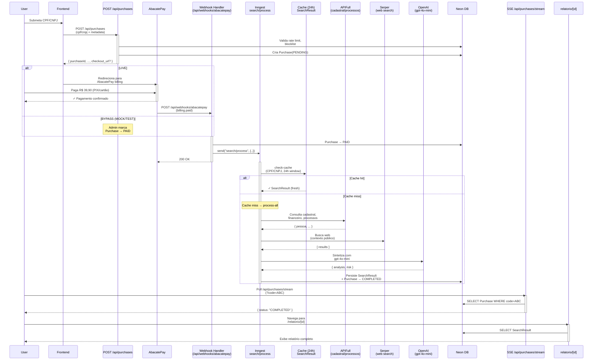
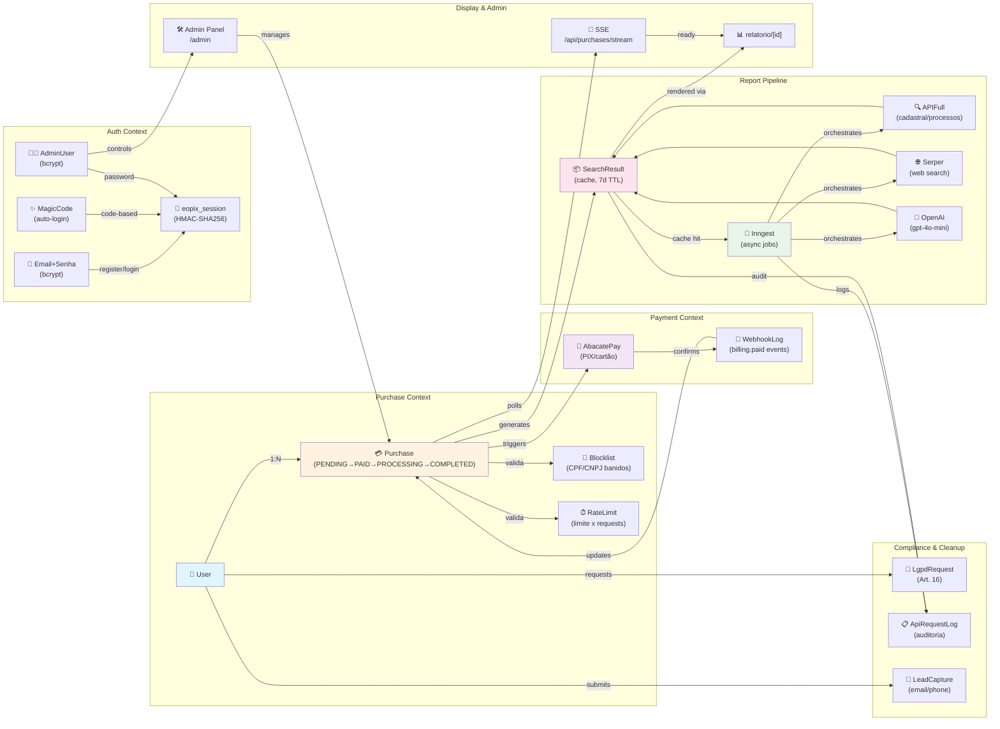

> **Última atualização:** 2026-03-07
> **Stack:** Next.js 14 · TypeScript · Prisma/Neon · AbacatePay · Inngest · OpenAI · APIFull · Serper
> **Preço:** R$ 39,90 (one-time purchase)

---

## Visão Geral

EOPIX é uma plataforma SaaS que gera relatórios consolidados de risco fiscal e legal para CPF e CNPJ através de:

1. **Pagamento único via AbacatePay** → Criação de `Purchase` no banco
2. **Processamento assíncrono via Inngest** → Consulta a APIFull, Serper, OpenAI
3. **Geração de relatório** → Armazenado em `SearchResult` com TTL de 7 dias
4. **Display ao usuário** → SSE polling + página dinâmica `/relatorio/[id]`

**Modos de execução:**
- `MOCK_MODE=true`: Dados mockados, pagamento bypassed (desenvolvimento local)
- `TEST_MODE=true`: APIs reais, pagamento bypassed (testes)
- Live: Pagamento real (AbacatePay), Inngest real (produção)

---

## 1. Diagrama de Fluxo Principal (Sequence Diagram)

Mostra o caminho completo da submissão do CPF/CNPJ até a exibição do relatório.



**Notas:**
- Em **LIVE**: Webhook do AbacatePay (`billing.paid`) é a origem da confirmação de pagamento
- Em **BYPASS** (MOCK/TEST): Admin marca Purchase como PAID, depois dispara `/api/process-search/[code]`
- **Cache check**: Se CPF/CNPJ já foi consultado em 24h, reutiliza resultado
- **TTL**: SearchResult expira em 7 dias (cron cleanup diário)

---

## 2. Mapa de Domínios (Graph LR com Subgraphs — DDD)

Mostra os bounded contexts e relações entre entidades e serviços.



**Bounded Contexts:**
- **Purchase Context**: Gerenciam pedidos e validações
- **Payment Context**: Integração AbacatePay e webhooks
- **Report Pipeline**: Inngest orquestra consultas de dados
- **Auth Context**: Email+Senha (bcrypt) + sessão + magic code + admin
- **Display & Admin**: SSE polling, relatório, painel administrativo
- **Compliance**: LGPD, auditoria, leads

---

## 3. Diagrama de Estados (Purchase State Machine)

Ciclo de vida completo de uma `Purchase`.

```mermaid
stateDiagram-v2
    [*] --> PENDING: POST /api/purchases<br/>(criada)

    PENDING --> PAID: AbacatePay webhook<br/>(billing.paid)<br/>OU admin marks paid

    PENDING --> [*]: cleanup cron<br/>(>30 min inativo)

    PAID --> PROCESSING: Inngest<br/>search/process sent

    PROCESSING --> COMPLETED: Pipeline finalizado<br/>SearchResult criada<br/>com sucesso

    PROCESSING --> FAILED: Erro em APIFull<br/>ou timeout

    COMPLETED --> [*]: Expiração TTL<br/>(7 dias)

    FAILED --> REFUNDED: Admin manual refund<br/>(via dashboard AbacatePay)

    FAILED --> [*]: Expiração<br/>(permanece no DB)

    REFUNDED --> [*]: Refund confirmado

    note right of PENDING
        Valida rate limit, blocklist
        Cria código único (code)
    end

    note right of PAID
        Purchase pronta para processamento
        Inngest job é disparado
    end

    note right of PROCESSING
        APIFull + Serper + OpenAI
        em execução
    end

    note right of COMPLETED
        SearchResult criada
        Usuário pode visualizar
        relatório por 7 dias
    end

    note right of FAILED
        Erro durante pipeline
        Sem SearchResult
    end

    note right of REFUNDED
        Reembolso processado
        Parcial ou total
    end
```

**Transições principais:**
- `PENDING` → `PAID`: Pagamento confirmado (webhook AbacatePay ou bypass)
- `PAID` → `PROCESSING`: Inngest inicia orquestração
- `PROCESSING` → `COMPLETED`: Pipeline sucesso → SearchResult criada
- `PROCESSING` → `FAILED`: Erro em qualquer etapa
- `FAILED` → `REFUNDED`: Refund manual pelo admin (via dashboard AbacatePay)
- `PENDING` → [*]: Cleanup de pedidos com >30 min inativo (cron)

---

## Como a IA Deve Usar Este Arquivo

### 1. **Entender o fluxo completo antes de modificar código**
   - Leia o Sequence Diagram (seção 1) para compreender a ordem de chamadas
   - Identifique o contexto em que você está atuando (ex: Auth, Payment, Pipeline)

### 2. **Referenciar bounded contexts (seção 2)**
   - Cada subgraph representa um domínio lógico
   - Use como guia para estrutura de pastas: `/api/purchases`, `/api/webhooks`, `/lib/inngest`, etc.

### 3. **Validar transições de estado (seção 3)**
   - Ao adicionar lógica de transição, consulte a máquina de estados
   - Garanta que transições inválidas não ocorram (ex: não ir de COMPLETED → PAID)
   - Cron jobs que lidam com estados devem estar mapeados aqui

### 4. **Cruzar referências com outros docs**
   - 📄 **[architecture.md](./architecture.md)** (você está aqui) — visão geral
   - 📄 **[status.md](./status.md)** — checklist de tasks e status vivo
   - 📄 **[modos-de-execucao.md](./modos-de-execucao.md)** — diferenças MOCK/TEST/Live
   - 📄 **[custos-e-fluxo-processamento.md](./custos-e-fluxo-processamento.md)** — API calls e preços
   - 📄 **[api-contracts/](./api-contracts/)** — especificações exatas de cada endpoint
   - 📄 **[CLAUDE.md](../CLAUDE.md)** — regras obrigatórias do projeto

### 5. **Tipos de mudanças comuns e onde encontrá-las**

| Tipo de Mudança | Diagrama(s) | Arquivo de Código | Doc de Referência |
|---|---|---|---|
| Novo estado Purchase | #3 (stateDiagram-v2) | `src/types/report.ts` | custos-e-fluxo-processamento.md |
| Novo serviço externo | #2 (subgraph) | `/src/lib/` | api-contracts/ |
| Nova transição | #3 | `/src/app/api/` ou `/src/inngest/` | modos-de-execucao.md |
| Auth novo provider | #2 (Auth Context) | `/src/lib/auth.ts` | CLAUDE.md |
| Cron job novo | #1 (nota) + #3 | `/src/inngest/` | custos-e-fluxo-processamento.md |

---

## Referências Cruzadas

### Arquivos Obrigatórios

- **[CLAUDE.md](../CLAUDE.md)** — Stack, regras não-negociáveis, comandos
- **[docs/status.md](./status.md)** — Checklist de tasks, status do projeto
- **[docs/modos-de-execucao.md](./modos-de-execucao.md)** — Diferenças entre MOCK, TEST, Live
- **[docs/custos-e-fluxo-processamento.md](./custos-e-fluxo-processamento.md)** — Custo por API, pipeline detalhado

### Contracts de API

- **[docs/api-contracts/cpf-cadastral.md](./api-contracts/cpf-cadastral.md)** — APIFull: registros cadastrais
- **[docs/api-contracts/cpf-financeiro.md](./api-contracts/cpf-financeiro.md)** — APIFull: dados financeiros
- **[docs/api-contracts/cpf-processos.md](./api-contracts/cpf-processos.md)** — APIFull: ações judiciais
- **[docs/api-contracts/cnpj-dossie.md](./api-contracts/cnpj-dossie.md)** — APIFull: dossier jurídico CNPJ
- **[docs/api-contracts/cnpj-financeiro.md](./api-contracts/cnpj-financeiro.md)** — APIFull: dados financeiros CNPJ

### Tipos Centrais

- **[src/types/report.ts](../src/types/report.ts)** — `SearchResult`, campos de relatório

### Scripts Úteis

```bash
# Desenvolvimento
npm run dev                 # Roda Next.js + Inngest (modo local com MOCK_MODE)

# Lint & Testes
npm run lint               # ESLint
npx vitest run             # Vitest (unit tests)

# Prisma
npx prisma studio         # Gerenciador visual do DB
npx prisma migrate dev    # Aplicar migrations
```

---

## Resumo de Componentes-Chave

### Frontend
- **`/app/page.tsx`** — Landing page, formulário CPF/CNPJ
- **`/app/relatorio/[id]/page.tsx`** — Display do relatório
- **`/app/admin/**`** — Painel administrativo

### Backend APIs
- **`/api/purchases`** — POST: criar compra, GET: listar/stream
- **`/api/webhooks/abacatepay`** — POST: receber eventos AbacatePay (`billing.paid`)
- **`/api/process-search/[code]`** — POST: fallback síncrono (MOCK/TEST/INNGEST_DEV)
- **`/api/auth/**`** — Register/Login (email+senha), auto-login (magic code)

### Inngest Jobs
- **`search/process`** — Main pipeline (check-cache → process-all)
- **`cleanupSearchResults`** — Diário 03:00
- **`cleanupLeads`** — Diário 03:15
- **`cleanupMagicCodes`** — Diário 03:30
- **`cleanupPendingPurchases`** — A cada 15 min
- **`anonymizePurchases`** — Mensal 1º dia (LGPD Art. 16)

### Banco de Dados (Prisma)
- **`User`** — Usuários autenticados
- **`Purchase`** — Pedidos com estado (PENDING→COMPLETED)
- **`SearchResult`** — Relatórios gerados (cache 7d)
- **`Blocklist`**, **`RateLimit`**, **`WebhookLog`**, **`MagicCode`**, **`AdminUser`**, **`LgpdRequest`**, **`LeadCapture`**, **`ApiRequestLog`** — Suporte e compliance

---

**🎯 Tudo pronto! Use este arquivo como referência ao:**
1. Entender requisitos de novos features
2. Debugar fluxos de dados
3. Planejar migrações de código
4. Adicionar testes e validações
5. Escalar ou otimizar o pipeline

